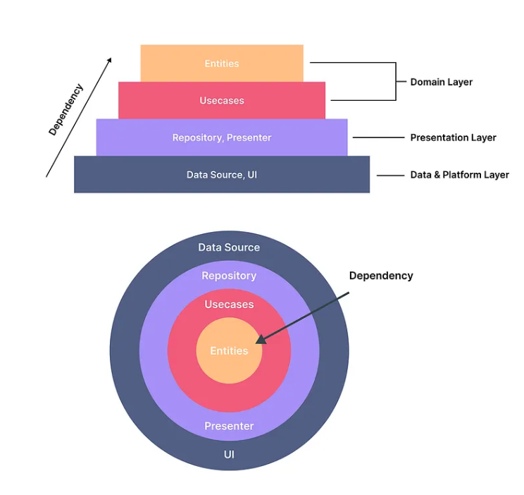
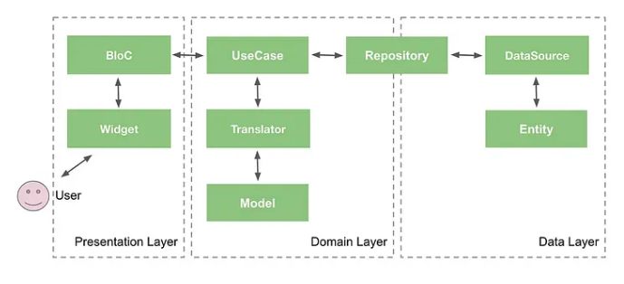

# Flutter Harness Project

**Repository-local AI coding harness for a feature-first Flutter app.**

This repository is a Flutter application wrapped in an agent-oriented harness.
The harness is the main architecture: it makes instructions, state, validation,
scope, lifecycle, runtime signals, and project-local skills visible on disk so
agents can restart work without hidden context.

Start here when working with the project:

1. [`AGENTS.md`](AGENTS.md) - short startup map for coding agents.
2. [`docs/harness/README.md`](docs/harness/README.md) - harness subsystem map.
3. [`feature_list.json`](feature_list.json) - feature status, dependencies, and
   evidence.
4. [`progress.md`](progress.md) - current session state and next steps.
5. [`session-handoff.md`](session-handoff.md) - restart notes for future
   sessions.

## Harness Architecture

The harness is split into durable subsystems. Each subsystem has checked-in
artifacts and a mechanical verification path.

| Subsystem | Primary artifacts | Responsibility |
| --- | --- | --- |
| Instructions | `AGENTS.md`, `docs/harness/` | Route agents to the right local rules without turning the root file into a manual. |
| State | `feature_list.json`, `progress.md` | Track active scope, feature status, dependencies, blockers, and evidence. |
| Verification | `init.sh`, `tool/harness.dart`, `test/harness/` | Provide repeatable bootstrap, doctor, structure, format, analyzer, and test commands. |
| Scope | `feature_list.json`, `docs/harness/TASKS.md` | Keep work feature-focused and record explicit dependencies before widening scope. |
| Lifecycle | `progress.md`, `session-handoff.md` | Preserve decisions, touched files, verification output, and the next restart path. |
| Skills | `.agents/skills/`, `docs/harness/SKILLS.md` | Keep Flutter and Dart task workflows local to the repository and progressively loaded. |
| Runtime signals | `lib/core/harness/`, `docs/harness/OPERABILITY.md` | Emit searchable `[harness]` debug events for startup and networking behavior. |

The root harness intentionally stays small. Deeper rules live under
`docs/harness/`:

| Document | Use it for |
| --- | --- |
| [`docs/harness/ARCHITECTURE.md`](docs/harness/ARCHITECTURE.md) | Flutter clean architecture boundaries and dependency rules. |
| [`docs/harness/VALIDATION.md`](docs/harness/VALIDATION.md) | Local commands, full check behavior, and failure triage. |
| [`docs/harness/SKILLS.md`](docs/harness/SKILLS.md) | Project-local Flutter and Dart agent skills. |
| [`docs/harness/QUALITY.md`](docs/harness/QUALITY.md) | Quality scorecard and known follow-ups. |
| [`docs/harness/OPERABILITY.md`](docs/harness/OPERABILITY.md) | Runtime logging and local observability notes. |
| [`docs/harness/TASKS.md`](docs/harness/TASKS.md) | Durable execution plans and session lifecycle rules. |

## Standard Workflow

For a fresh session, use the walkinglabs-compatible lifecycle entrypoint:

```bash
./init.sh
```

`init.sh` bootstraps the Flutter project and then runs the full harness check.
For narrower iteration, use the Dart harness runner directly:

```bash
# Inspect tools, generated files, harness docs, and local skills
fvm dart run tool/harness.dart doctor

# Run structural guard tests
fvm dart run tool/harness.dart structure

# Install dependencies and regenerate committed generated files
fvm dart run tool/harness.dart bootstrap

# Run format, structure, analyzer, and Flutter tests
fvm dart run tool/harness.dart check
```

Run `structure` after harness or architecture edits. Run `check` before handing
off broad changes. Update `progress.md`, `feature_list.json`, and
`session-handoff.md` when status, evidence, blockers, or restart instructions
change.

## Flutter App Architecture

The app remains a feature-first Flutter project. Business features follow clean
architecture boundaries:

```text
lib/features/<feature>/
  domain/
    entities/
    repositories/
    usecase/
  data/
    datasource/
    models/
    repositories/
  presentation/
    bloc/
    pages/
    widgets/
```

Layer rules are enforced by `test/harness/architecture_guard_test.dart`:

- `domain` must not import `data` or `presentation`.
- `data` may depend on `domain` and core infrastructure, but not presentation.
- `presentation` owns Flutter UI, pages, widgets, and BLoCs.
- `core/router/app_router.dart` is the explicit app composition point.
- `AppConfig` owns flavor behavior; avoid ad hoc flavor checks.



## Runtime And Data Flow

The development flavor can run against checked-in mock API data. Networking,
configuration, and startup behavior should stay inspectable through structured
debug events documented in [`docs/harness/OPERABILITY.md`](docs/harness/OPERABILITY.md).



Request flow:

```text
UI -> Event -> BLoC -> UseCase -> Repository -> DataSource -> API/mock data
```

Response flow:

```text
API/mock data -> Model -> Entity -> UseCase -> BLoC -> State -> UI
```

## Project Surface

- Flutter SDK `3.44.0`, managed by FVM.
- Dart SDK `>=3.9.2 <4.0.0`.
- Flavors: `dev`, `stg`, and `prod`.
- State management: `flutter_bloc`.
- Routing: `go_router`.
- Networking: Dio with interceptors, mock API support, and proxy behavior.
- Dependency injection: `get_it` and `injectable`.
- Generated Dart files are committed and must stay synchronized after annotation
  changes.
- CI runs the standard harness lifecycle through `.github/workflows/harness.yml`.

## Run The App

```bash
# Development flavor with local mock API support
fvm flutter run --flavor dev --dart-define-from-file=dart_defines/dev.json

# Staging flavor
fvm flutter run --flavor stg --dart-define-from-file=dart_defines/stg.json

# Production flavor
fvm flutter run --flavor prod --dart-define-from-file=dart_defines/prod.json
```

## Build Commands

```bash
# Development APK
fvm flutter build apk --flavor dev --dart-define-from-file=dart_defines/dev.json

# Staging APK
fvm flutter build apk --flavor stg --dart-define-from-file=dart_defines/stg.json

# Production APK
fvm flutter build apk --flavor prod --dart-define-from-file=dart_defines/prod.json

# Production iOS build
fvm flutter build ios --flavor prod --dart-define-from-file=dart_defines/prod.json
```

## Definition Of Done

A change is harness-ready when:

- The target behavior or repository-visible outcome is implemented.
- Relevant harness docs and root state artifacts match the change.
- The smallest meaningful verification command has run and the result is
  recorded.
- Any generated files affected by annotations are regenerated and committed.
- The next agent can restart from `./init.sh` or from a documented failing
  baseline with an exact next action.

## License

Licensed under the Apache License, Version 2.0. See [`LICENSE`](LICENSE) for the
full license text.
